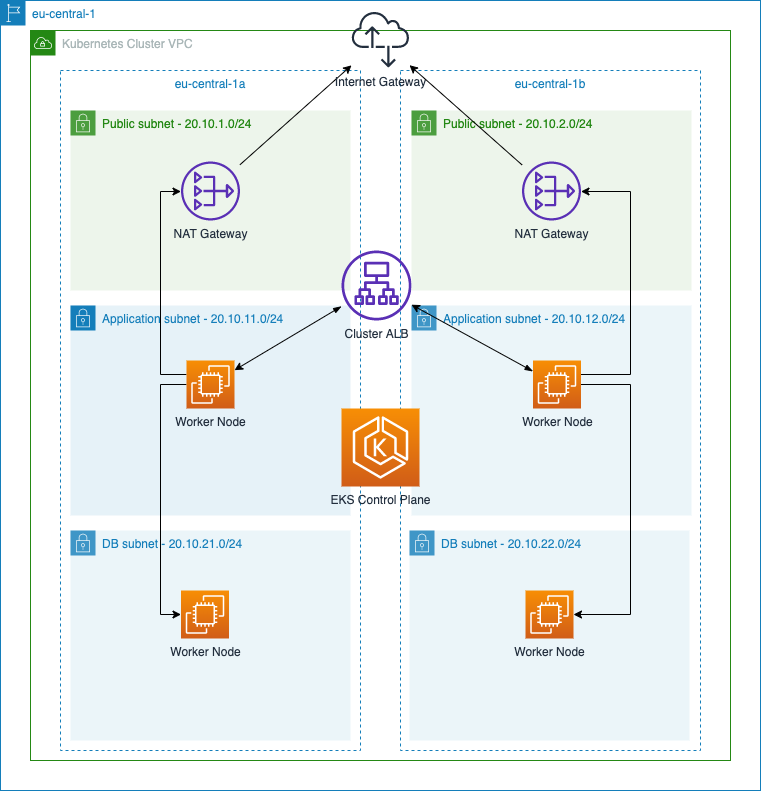
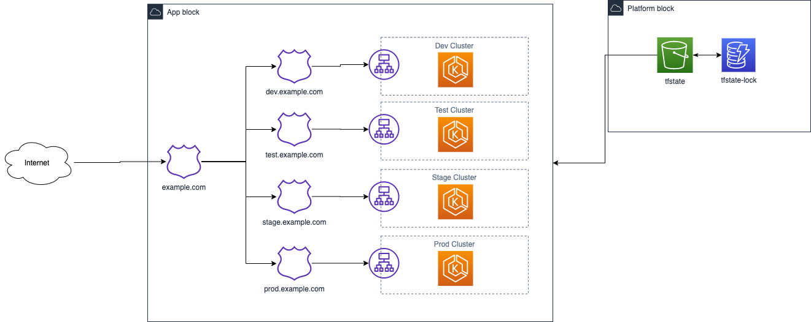

# System Architecture

The platform rely on AWS network resources to deliver a scalable and secure solution.
Each cluster runs on its unique VPC (Virtual Private Cloud), with dedicate network setup for EKS clusters to be hosted, as the following image shows:

To improve reliability and redundancy, the VPC resources are spread by the number of AZs in an AWS region.
Each AZ has a public subnet with NAT Gateways to allow outbound traffic, a private subnet dedicated for application deployments, and a private subnet dedicated for databases.
The database subnet cannot be accessed externally. 

A public ALB is created to access the ingress controller inside the cluster, via a NodePort service. The EKS control plane is managed by AWS, but it requires permissions to access the worker nodes.
The control plane manages deployments to the subnets by using the `nodeSelector` feature.

This solution works both for single-account environments as well as multi-tenancy account. The state is managed in another place, which makes it possible to create resources in different accounts, if your user has permission to do so.
The "clusters" environment can be seen on the next diagram.

